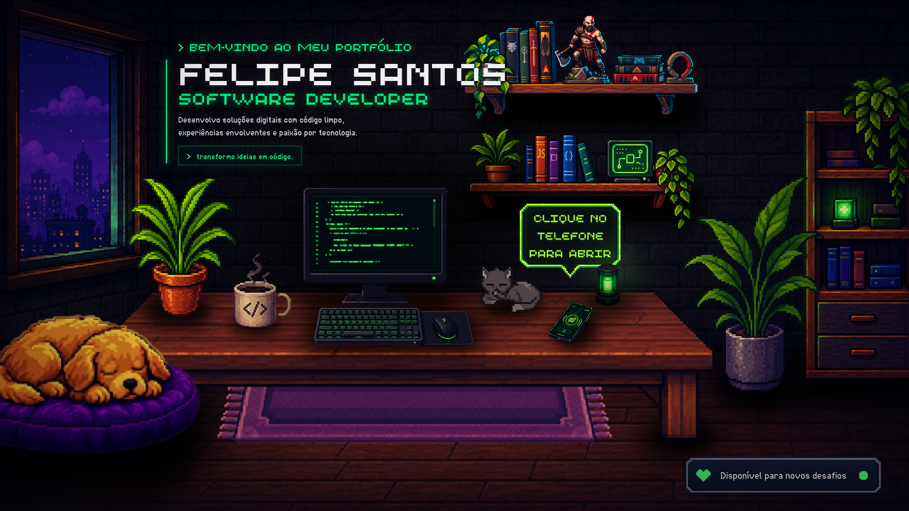
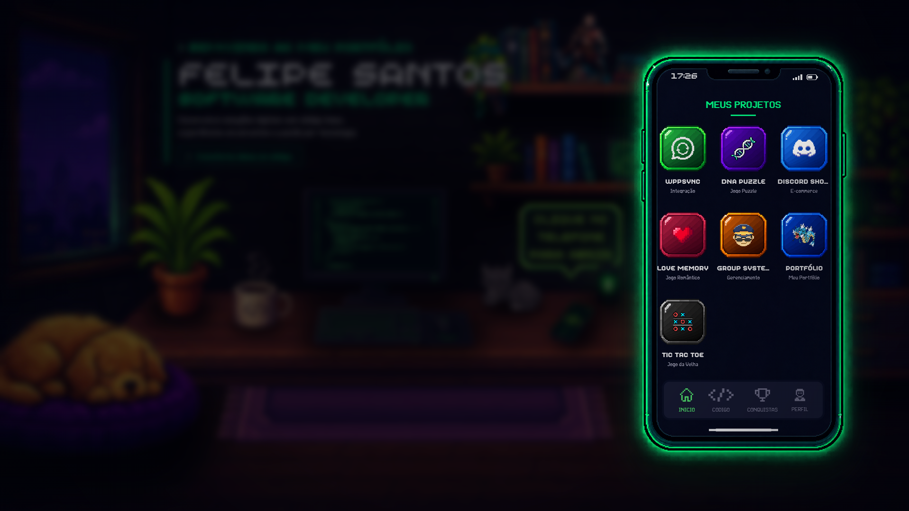

<div align="center">

# ImString — Portfólio

Uma experiência interativa em pixel art para apresentar quem sou e os projetos que desenvolvo.

[**Explorar o portfólio**](https://imstring.dev) · [Ver projetos](https://github.com/ImString?tab=repositories)

[](https://github.com/ImString/portfolio/actions/workflows/deploy-production.yml)


</div>

## Sobre

Este é o portfólio pessoal de **Felipe Santos**, também conhecido como **ImString**. O projeto transforma um quarto de desenvolvedor em uma interface viva: personagens animados, objetos em pixel art e um telefone interativo conduzem o visitante até os trabalhos apresentados.

No desktop, a navegação começa pela cena completa e o telefone sobre a mesa abre a vitrine de projetos. Em telas menores, essa vitrine assume o centro da experiência para manter a navegação simples e direta.

## Preview

### Cena principal

Uma composição responsiva em pixel art com elementos animados, apresentação profissional e pistas visuais de interação.

<a href="https://imstring.dev">
  
</a>

### Vitrine de projetos

O telefone funciona como um launcher: cada aplicativo representa um projeto e leva para sua demonstração ou repositório.

<a href="https://imstring.dev">
  
</a>

## Destaques

- Cenário interativo construído em camadas de pixel art.
- Animações com sprite sheets e movimentos em CSS.
- Telefone com links para projetos publicados e repositórios.
- Experiências específicas para desktop e dispositivos móveis.
- Layout adaptável a diferentes proporções e resoluções de tela.
- Navegação por teclado, descrições acessíveis e suporte a movimento reduzido.
- Deploy automatizado em produção pelo GitHub Actions.

## Tecnologias

- **React 19** para a interface e o comportamento dos componentes.
- **TypeScript** para tipagem e maior segurança durante o desenvolvimento.
- **Vite** para o ambiente de desenvolvimento e a build de produção.
- **styled-components** para estilos, animações e componentes responsivos.
- **CSS** e **sprite sheets** para a direção visual em pixel art.

## Executando localmente

### Pré-requisitos

- [Node.js](https://nodejs.org/) 22 ou superior
- [pnpm](https://pnpm.io/) 10 ou superior

```bash
git clone https://github.com/ImString/portfolio.git
cd portfolio
pnpm install
pnpm dev
```

O projeto ficará disponível no endereço exibido pelo Vite, normalmente `http://localhost:5173`.

## Comandos

| Comando | Descrição |
| --- | --- |
| `pnpm dev` | Inicia o ambiente de desenvolvimento. |
| `pnpm build` | Valida o TypeScript e gera a build de produção. |
| `pnpm preview` | Executa localmente a build gerada. |
| `pnpm lint` | Analisa o código com ESLint. |

## Estrutura do projeto

```text
portfolio/
├── .github/           # Workflow de deploy e imagens do README
├── public/            # Pixel art, fontes, ícones e sprite sheets
├── src/
│   ├── components/    # Elementos e personagens da cena
│   ├── pages/         # Interface do telefone e projetos
│   ├── App.tsx        # Composição, interações e responsividade
│   └── main.tsx       # Entrada da aplicação
└── index.html         # Documento base e metadados sociais
```

## Deploy

Todo push na branch `main` inicia o workflow de produção. Ele instala as dependências, gera a build com o Vite e publica o conteúdo de `dist/` no servidor configurado.

---

<div align="center">

Desenvolvido por [**Felipe Santos — ImString**](https://github.com/ImString).

</div>
